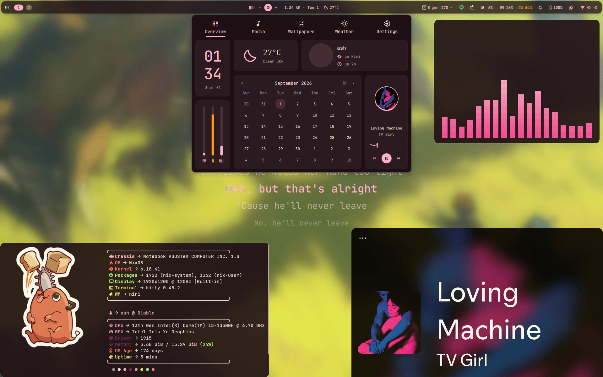
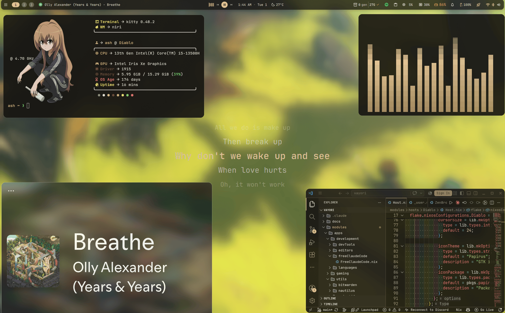
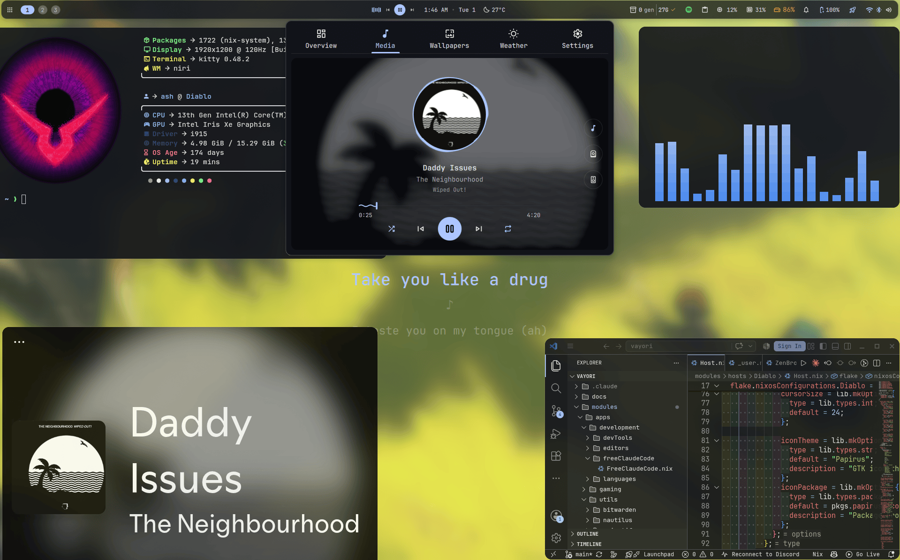

# Vayori

<p>
  
  
  
  <a href="LICENSE"></a>
  <a href="https://github.com/aayush2622/Vayori-Rice/stargazers"></a>
</p>

My NixOS setup. [niri](https://github.com/YaLTeR/niri) +
[DankMaterialShell](https://github.com/AvengeMedia/DankMaterialShell), with a
wallpaper-matching color theme that's gone a little too far - editors, login
screen, GRUB, Wine dialogs, all of it. Written with
[flake-parts](https://flake.parts/) + [import-tree](https://github.com/vic/import-tree),
so every `.nix` file under `modules/` just gets picked up - no import list to
maintain.

> [!WARNING]
> This is my actual laptop's config, not a template you run as-is. Real
> disk UUIDs and login info live in two gitignored files that don't exist
> until you make them - the build refuses to evaluate without them, on
> purpose. Two minutes, see [Quick start](#quick-start) below.

If this saves you an evening, a star costs nothing. ⭐

<p>
  
  
</p>
<p align="center">
  
</p>

## Contents

[Quick start](#quick-start) · [Secrets](#secrets) ·
[Your own machine](#using-this-on-your-own-machine) · [Layout](#layout) ·
[Docs](#documentation) · [Keybinds](#keybinds-niri) · [Credits](#credits)

---

## What's in it

- **Desktop** - niri (config wrapped declaratively via
  [nix-wrapper-modules](https://github.com/BirdeeHub/nix-wrapper-modules)),
  DMS for bar/launcher/notifications/lock, a themed SDDM greeter + GRUB,
  kitty/zsh with fastfetch.
- **Dev** - VS Code, Android Studio, and Zed, all pre-configured; seven
  language toggles that install tooling *and* tell all three editors what
  to install for it; [Free Claude Code](https://github.com/Alishahryar1/free-claude-code)
  for a free-tier model in your CLI/editor.
- **Gaming** - Steam, Lutris + Heroic, GE-Proton, MangoHud, all color-matched
  too.
- **Everything else** - Zen Browser, Nautilus, Spicetify, Bitwarden, Vesktop,
  an ASUS control widget - all opt-in per machine under `modules/apps/`.

## Prerequisites

NixOS with flakes enabled, UEFI boot, and `mkpasswd`
(`nix run nixpkgs#mkpasswd`) for the one password hash you'll need.

---

## Quick start

```bash
git clone https://github.com/aayush2622/Vayori-Rice.git vayori
cd vayori
cp modules/hosts/Diablo/_hardware.nix.example modules/hosts/Diablo/_hardware.nix
cp modules/hosts/Diablo/_user.nix.example modules/hosts/Diablo/_user.nix
$EDITOR modules/hosts/Diablo/_user.nix   # at least pick a username
sudo nixos-rebuild switch --flake path:.#Diablo
```

`path:.#Diablo`, not `.#Diablo` - see
[why below](#using-this-on-your-own-machine). Any user without a
`hashedPassword` logs in with `changeme` - run `passwd` after.

---

## Secrets

API keys and the like live directly in `_user.nix`, per user:

```nix
ash.secrets = {
  WAKATIME_API_KEY = "...";
  RBW_EMAIL = "...";
  PROVIDERS.NVIDIA_NIM_API_KEY = "...";  # open-ended, add any provider
};
```

Edit, rebuild, done - no runtime file to seed or re-edit. Leave a key out
and whatever needed it just doesn't get installed, instead of getting
configured with a key that would only fail. Full shape in
[docs/core.md](docs/core.md#modulescoreusersnix).

Everything else (browser profile, editor logins, rbw session) lives under
one portable folder, `~/.config/vayori/session`, with its own backup CLI:

```bash
vayori-app-state backup ~/vayori-session.enc
```

Details in [docs/apps-utils.md](docs/apps-utils.md#modulesappsutilsstatebackupstatebackupnix).

---

## Using this on your own machine

A host is three files under `modules/hosts/<name>/`: `Host.nix` (apps,
timezone, bootloader), `_hardware.nix`, `_user.nix` (the last two
gitignored + required - everything else in that folder is gitignored by
default too, so anything personal you add later stays untracked with no
extra `.gitignore` line).

Build with `path:.#<host>`, not a bare ref - a bare ref resolves through
git's tracked-files view, which makes the two gitignored files look
"missing" even though they're right there. `path:` uses the real
directory as-is.

1. `cp -r modules/hosts/Diablo modules/hosts/<yourhostname>`
2. `sudo nixos-generate-config --show-hardware-config > modules/hosts/<yourhostname>/_hardware.nix`
   (drop the Nvidia/Optimus block unless you're also on one)
3. `cp .../<yourhostname>/_user.nix.example .../<yourhostname>/_user.nix`,
   fill it in (`mkpasswd -m sha-512` for the hash)
4. Edit `Host.nix` - rename the host, adjust `vayori.apps`, fix
   timezone/locale/bootloader
5. `sudo nixos-rebuild switch --flake path:.#<yourhostname>`

Full field-by-field shape: [docs/core.md](docs/core.md#modulescoreusersnix).

---

## Layout

```text
flake.nix          inputs + import-tree ./modules
modules/
  core/               flake-parts wiring, the shared user/app framework
  hosts/<name>/       Host.nix + _hardware.nix + _user.nix (see above)
  desktop/            niri, DMS, fonts/portals, GTK/Qt baseline, matugen
  system/             docker/libvirtd, zram, GRUB theme
  apps/               opt-in per-user modules, picked via vayori.apps
    development/        editors, languages, dev-tools, Free Claude Code
    gaming/             launchers, proton, performance tweaks
    utils/              terminal, browser, everything else
  assets/wallpapers/  default wallpaper set
```

## Extending it

**Add a person**: entry in `_user.nix`. **Add an app**: folder under
`modules/apps/*/` that sets `flake.homeModules.apps.<Name>` - picked up
automatically. **Add a host**: copy `modules/hosts/Diablo/`. Details on all
three in [docs/CONFIGURATION.md](docs/CONFIGURATION.md).

---

## Documentation

| Doc | Covers |
| --- | --- |
| [docs/CONFIGURATION.md](docs/CONFIGURATION.md) | Index - how it's wired together |
| [docs/core.md](docs/core.md) | Users, apps, languages, host/hardware config |
| [docs/desktop.md](docs/desktop.md) | DMS, niri, fonts/portals, matugen |
| [docs/system.md](docs/system.md) | Docker/libvirtd, GRUB theming |
| [docs/apps-development.md](docs/apps-development.md) | Editors, languages, Free Claude Code |
| [docs/apps-gaming.md](docs/apps-gaming.md) | The gaming setup |
| [docs/apps-utils.md](docs/apps-utils.md) | Browser, Spicetify, Nautilus, Bitwarden, terminal, Vesktop |

The `.nix` files stay comment-free - all the "why" lives here instead.

---

## Keybinds (niri)

| Key | Action | Key | Action |
| --- | --- | --- | --- |
| `Mod+Return` | terminal | `Mod+Q` / `Alt+F4` | close window |
| `Mod+E` | file manager | `Mod+F` / `Shift+F11` | fullscreen |
| `Mod+C` | code | `Mod+W` | toggle floating |
| `Mod+B` | browser | `Mod+←/→/↑/↓` | focus column/window |
| `Mod+A` / `Mod+S` | app launcher | `Mod+Shift+←/→/↑/↓` | move column/window |
| `Mod+V` | clipboard history | `Mod+1`-`0` | switch workspace |
| `Mod+Comma` | settings | `Mod+Shift+1`-`0` | move to workspace |
| `Mod+L` | lock | `Mod+Shift+P` | color picker |
| `Mod+Tab` | overview | `Print` / `Shift+Print` | screenshot |

Full list in [modules/desktop/Niri.nix](modules/desktop/Niri.nix).

---

## Credits

| Project | For |
| --- | --- |
| [niri](https://github.com/YaLTeR/niri) | the compositor |
| [DankMaterialShell](https://github.com/AvengeMedia/DankMaterialShell) | bar, launcher, lock, theming |
| [matugen](https://github.com/InioX/matugen) | the color engine behind all of it |
| [home-manager](https://github.com/nix-community/home-manager) · [flake-parts](https://flake.parts/) · [import-tree](https://github.com/vic/import-tree) | the Nix plumbing |
| [Bibata](https://github.com/ful1e5/Bibata_Cursor) · [Papirus](https://github.com/PapirusDevelopmentTeam/papirus-icon-theme) · [Catppuccin](https://github.com/catppuccin) | cursor/icons/editor theme |
| [Free Claude Code](https://github.com/Alishahryar1/free-claude-code) · [WakaTime](https://wakatime.com/) | the dev-editor integrations |
| [Vencord](https://github.com/Vendicated/Vencord) · [DankAsusControl](https://github.com/shazzaam7/DankAsusControl) | Discord mods, ASUS widget |

Full pinned list: `flake.nix`.

## License

[MIT](LICENSE). Use it, fork it, take what you want.

## Known caveats

`dankAsusControlCenter` builds fine but hasn't met real ASUS hardware in
testing yet - see [docs/desktop.md](docs/desktop.md#modulesdesktopdmsnix)
if `asusctl`/`supergfxctl` won't cooperate.
